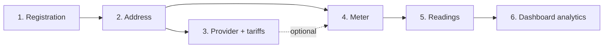

# Komunalka — User Documentation

**Komunalka** is a web application for tracking utility services: addresses, meters, readings, service providers, and tariffs. The interface is entirely in Ukrainian, with the currency in hryvnia (₴).

> The documentation has been verified through end-to-end browser testing (07/16/2026): the full cycle from registration to account deletion was completed, with all message texts and form behavior checked against the actual interface.

## Contents

| Section | Description |
|---|---|
| [1. Registration and Login](01-getting-started.md) | Creating an account, logging in, OAuth (Google/GitHub), password recovery |
| [2. Navigation and Dashboard](02-navigation-dashboard.md) | Interface structure, home page, themes |
| [3. Addresses](03-addresses.md) | Creating and managing tracked addresses |
| [4. Providers and Tariffs](04-providers-tariffs.md) | Service providers, tariffs, multi-tariff tracking |
| [5. Meters](05-meters.md) | Adding meters, photos, activity |
| [6. Readings](06-readings.md) | Entering readings, history, consumption and cost calculation |
| [7. Account Settings](07-settings.md) | Profile, password, linked accounts, account deletion |
| [8. Help and KhatkoBot](08-help-assistant.md) | AI assistant and help page |
| [9. Usage Scenarios](09-user-scenarios.md) | Step-by-step scenarios from first login to analytics |
| [10. Known Limitations](10-known-limitations.md) | Limitations of the current version |

## Quick Start: Recommended Order of Actions

Data in the system has a clear dependency hierarchy, so setup should be performed in the following order:

1. **Register** — via email + password or through Google/GitHub.
2. **Add an address** (`My Addresses`) — without an address, you cannot create a provider or a meter.
3. **Add a provider with tariffs** (`Providers`) — needed to calculate the cost of consumption. This step is optional, but without it there will be no cost calculation or multi-tariff tracking.
4. **Add meters** (`Meters`) — each meter is linked to an address and a service type; a provider can be assigned right away or later.
5. **Enter readings** (`Enter Readings`) — in bulk for all meters at an address at once.
6. **Analyze consumption** on the Dashboard — consumption chart, cost breakdown, latest readings.

## Dependencies Between Entities

| Entity | Depends on | Requirement |
|---|---|---|
| Address | Region, property type (reference data) | — |
| Provider | Address, service type | Address is required and cannot be changed afterward |
| Tariff | Provider | Created together with the provider |
| Meter | Address, service type; provider | Provider is optional |
| Reading | Meter; tariff | Tariff is applied automatically if the meter has a provider |

Service types are fixed: **Electricity (kWh), Gas (m³), Cold water (m³), Hot water (m³), Heating (Gcal), Sewage (m³)**.

## Consequences of Deletion

- **Deleting an address** — the address disappears from your lists along with access to its providers and meters. This action is irreversible through the interface.
- **Deleting a provider** — its tariffs are deleted; meters remain but lose their link to the provider (new readings will have no cost calculation).
- **Deleting a meter** — the entire reading history for it is deleted.
- **Deleting an account** — all data is lost; requires password confirmation.
