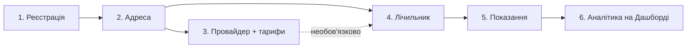

# Комуналка — Користувацька документація

**Комуналка** — вебзастосунок для обліку комунальних послуг: адрес, лічильників, показань, постачальників послуг і тарифів. Інтерфейс повністю українською мовою, валюта — гривня (₴).

> Документацію верифіковано наскрізним браузерним тестуванням (16.07.2026): пройдено повний цикл від реєстрації до видалення акаунта, всі тексти повідомлень і поведінка форм звірені з реальним інтерфейсом.

## Зміст

| Розділ | Опис |
|---|---|
| [1. Реєстрація та вхід](01-getting-started.md) | Створення акаунта, вхід, OAuth (Google/GitHub), відновлення пароля |
| [2. Навігація та Дашборд](02-navigation-dashboard.md) | Структура інтерфейсу, головна сторінка, теми оформлення |
| [3. Адреси](03-addresses.md) | Створення та керування адресами обліку |
| [4. Провайдери та тарифи](04-providers-tariffs.md) | Постачальники послуг, тарифи, багатотарифний облік |
| [5. Лічильники](05-meters.md) | Додавання лічильників, фото, активність |
| [6. Показання](06-readings.md) | Внесення показань, історія, розрахунок споживання та вартості |
| [7. Налаштування акаунта](07-settings.md) | Профіль, пароль, зв'язані акаунти, видалення акаунта |
| [8. Допомога та ХаткоБот](08-help-assistant.md) | AI-помічник і сторінка допомоги |
| [9. Сценарії використання](09-user-scenarios.md) | Покрокові сценарії від першого входу до аналітики |
| [10. Відомі особливості](10-known-limitations.md) | Обмеження поточної версії |

## Швидкий старт: рекомендований порядок дій

Дані в системі мають чітку ієрархію залежностей, тому налаштування виконується у такому порядку:

1. **Зареєструйтеся** — email + пароль або через Google/GitHub.
2. **Додайте адресу** (`Мої адреси`) — без адреси неможливо створити ні провайдера, ні лічильник.
3. **Додайте провайдера з тарифами** (`Провайдери`) — потрібен для розрахунку вартості спожитого. Крок необов'язковий, але без нього не буде розрахунку витрат і багатотарифного обліку.
4. **Додайте лічильники** (`Лічильники`) — кожен лічильник прив'язується до адреси й типу послуги; провайдера можна вказати одразу або пізніше.
5. **Вносьте показання** (`Внести показання`) — пакетно для всіх лічильників адреси за один раз.
6. **Аналізуйте споживання** на Дашборді — графік споживання, розподіл витрат, останні показання.

## Залежності між сутностями

| Сутність | Залежить від | Обов'язковість |
|---|---|---|
| Адреса | Область, тип нерухомості (довідники) | — |
| Провайдер | Адреса, тип послуги | Адреса обов'язкова, змінити її потім не можна |
| Тариф | Провайдер | Створюється разом із провайдером |
| Лічильник | Адреса, тип послуги; провайдер | Провайдер необов'язковий |
| Показання | Лічильник; тариф | Тариф підставляється автоматично, якщо у лічильника є провайдер |

Типи послуг фіксовані: **Електроенергія (кВт·год), Газ (м³), Холодна вода (м³), Гаряча вода (м³), Опалення (Гкал), Каналізація (м³)**.

## Наслідки видалення

- **Видалення адреси** — адреса зникає з ваших списків разом із доступом до її провайдерів і лічильників. Дія незворотна через інтерфейс.
- **Видалення провайдера** — його тарифи видаляються; лічильники залишаються, але втрачають прив'язку до провайдера (нові показання будуть без розрахунку вартості).
- **Видалення лічильника** — видаляється вся історія його показань.
- **Видалення акаунта** — втрата всіх даних; вимагає підтвердження паролем.
